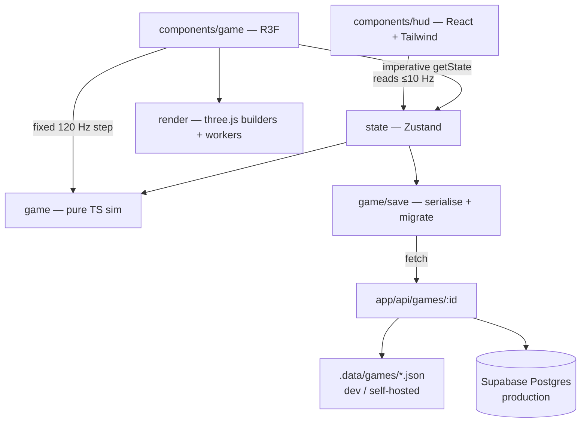
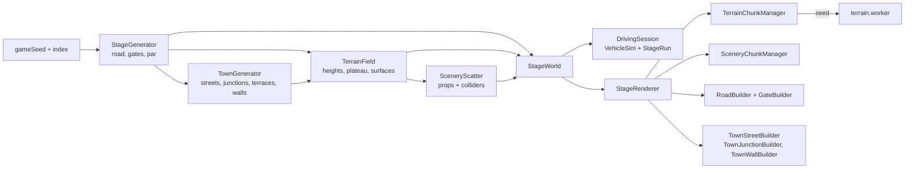
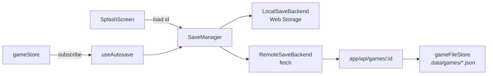
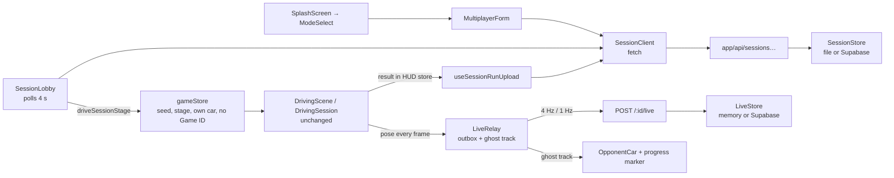

# Architecture

## Layers

```mermaid
flowchart TD
  UI[components/hud — React + Tailwind] -->|reads ≤10 Hz| Store[state — Zustand]
  Scene[components/game — R3F] -->|imperative getState| Store
  Scene --> Render[render — three.js builders + workers]
  Scene -->|fixed 120 Hz step| Sim[game — pure TS sim]
  Store --> Sim
  Store --> Save[game/save — serialise + migrate]
  Save -->|fetch| API[app/api/games/:id]
  API --> Files[.data/games/*.json\ndev / self-hosted]
  API --> Supabase[(Supabase Postgres\nproduction)]
```

- **`src/game`, `src/lib`** — pure TypeScript. No `three`, no React. Vehicle
  physics, stage generation (splines, checkpoints, timing), economy, save
  format. Everything here is deterministic and unit-tested.
- **`src/render`** — three.js geometry/material builders, terrain chunk
  workers, particles, skid marks. Each builder returns disposables.
- **Car models** — `components/game/CarModel` builds every car from
  primitives (`bodies/*Body.tsx`) around shared wheels, interior and an
  imperative handle; the lofted hulls (`render/car/CarHull.ts`) and the
  buggy's free-standing mudguards (`render/car/FenderShell.ts`) are pure TS
  builders. The GLBs in `assets/` are measurement references only.
- **`src/components/game`** — R3F `<Canvas>`, scene graph, camera rigs. The
  frame loop accumulates time and steps the sim at a fixed 120 Hz, then
  interpolates transforms for rendering.
- **`src/components/hud`** — menus, HUD, garage, settings. Subscribes to
  throttled store slices; never re-renders per frame.
- **Pace notes** — `game/stage/PaceNotes.ts` grades the stage's corners
  (pure, once per stage); `DrivingSession` puts them in the HUD store with
  the car's race distance (`StageRun.along`) at 10 Hz, and
  `hud/PaceNoteCallout` picks the next one (`nextPaceNote`) and draws it
  with `PaceNoteIcon` from the pixel grids in `hud/paceNotePixels.ts`.
- **`src/state`** — Zustand stores (game/meta state, settings).
- **`src/i18n`** — typed dictionaries; `en` is the source of truth for keys.

## Frame loop (from milestone 2)

1. `useFrame` reads input refs.
2. Accumulator steps `VehicleSim` at `1/120 s`, keeping previous + current
   state.
3. Render transforms = lerp/slerp(previous, current, alpha) into reused
   temp objects.
4. Active `CameraRig.update(dt)` positions the camera.
   `wheelContacts` (pure) turns the pose + slip into four contact patches and
   `SkidMarks` (render) appends quads to its ring buffer when a tyre scrubs.
5. HUD snapshot is pushed to the store at ≤ 10 Hz.

## Stage pipeline (milestone 3)

```mermaid
flowchart LR
  Seed[gameSeed + index] --> Gen[StageGenerator\nroad, gates, par]
  Gen --> Town[TownGenerator\nstreets, junctions, terraces, walls]
  Gen & Town --> Field[TerrainField\nheights, plateau, surfaces]
  Field --> Scatter[SceneryScatter\nprops + colliders]
  Gen & Field & Scatter --> World[StageWorld]
  World --> Session[DrivingSession\nVehicleSim + StageRun]
  World --> Renderer[StageRenderer]
  Renderer --> Terrain[TerrainChunkManager] -->|seed| Worker[terrain.worker]
  Renderer --> Scenery[SceneryChunkManager]
  Renderer --> Road[RoadBuilder + GateBuilder]
  Renderer --> Streets[TownStreetBuilder\nTownJunctionBuilder, TownWallBuilder]
```

- Terrain chunks are meshed in `terrain.worker`, which rebuilds the stage
  from its seed and says `ready`. Until then (its script still loading, the
  stage still generating), and for good if it errors, `TerrainChunkManager`
  meshes the nearest chunks on the main thread within 4 ms a frame, so the
  ground never lags the road and scenery.

- Coast (`game/stage/CoastShape.ts`, `CoastRoad.ts`, `Coastline.ts`): the
  shape is the lie of the land in stage-axis coordinates (water line, beach,
  terraced cliff band, hillside), the road is drawn on it with hairpin
  stacks, and the coastline reads the ground in world space and lays the
  retaining walls on whichever side falls away; `TerrainField.baseHeight`
  delegates to it and carries its rock mask in every sample, `SceneryScatter`
  reads its shore distance and slope, `StageWorld` adds its wall boxes as
  colliders, the mesher paints the mask rock and the shore sand, and the
  renderer draws the walls (`render/road/SeaWallBuilder.ts` over
  `StoneWallGeometry.ts`) and the sea (`render/terrain/SeaPlane.ts`).
- Arctic: no modules of its own. The stage type's `terrain.banks` heaps the
  snow ridges in `TerrainField.bankLift` (both the mesh sample and the
  wheels' deck), `SceneryDensity.spruces` feeds the `spruce` prop kind
  through the ordinary scatter, and `kits/SpruceKits.ts` dresses it in
  three parts (trunk, tinted foliage, snow caps) from `SpruceGeometry.ts`.
- Alpine: its woods are `render/scenery/SnowPineGeometry.ts` (tiered snow
  pines, each tier a whorl of branch tips) and `AlpineTreeGeometry.ts` (a
  bare tree, a snowy bush), dressed by
  `kits/AlpineKits.ts`, which `rallyKits` takes for the stock pine,
  broadleaf, bush and shared trunk when the stage is Alpine
  (`sceneryKitsFor`); each prop's shape is picked by its spot.
  Spectators are placed by `game/stage/Spectators.ts` (crowds at the start,
  gates, crests and finish, groups between) and drawn by
  `render/scenery/kits/SpectatorKits.ts` as two kits per pose from
  `SpectatorGeometry.ts`: a fixed-colour body and a white jacket for the tint.
- Circuits (`game/stage/CircuitGenerator.ts`, `CircuitStage.ts`,
  `CircuitTrackside.ts`): every tenth stage (the next one where a city
  holds the tenth, see `stageSlot` in `regions.ts`) is a closed race
  circuit. The generator draws a lap as a closed `RoadPath` (`closed`: the
  last sample sits on the first, `sample` wraps), and one lap of geometry is
  all the rest of the pipeline sees: terrain (`RoadProfile.ts` smooths the
  road profile cyclically), road mesh, scenery and nearest-point queries work
  unchanged. Only timing knows about laps: the gates are unrolled over every
  lap with distances that keep counting, and `StageRun` unwraps the lap
  position against the last gate passed. The trackside (kerbs, gravel
  traps, barrier lines, catch-fence flags, the grandstand's footprint) is
  derived from the lap's curvature, memoised per stage; `TerrainField`
  reads it for the flat runoff, kerb bumps and surfaces, `SceneryScatter`
  for clearance, `StageWorld` for the barrier colliders, and the renderer
  draws it (`render/road/KerbBuilder.ts`, `BarrierBuilder.ts`,
  `CircuitDressingBuilder.ts` over `TrackMesh.ts`), each behind its own
  `StageRenderOptions` flag.
- City map (`game/stage/city/`): `CityGrid` draws the warped lattice of
  crossroads and streets; `CityRoute` walks the route along it and lays it as
  town legs (`planUrban` returns them with the map), so `buildCentreline`,
  gates and progress are unchanged; `CityMap.cityToWorld` places the map on
  the traced entry; `CityMap.cityStreets` picks the crossroads and streets
  the city lays (shared by `CityNetwork` and `TramLoop`); `CityFrontage` walks
  `CityNetwork`'s street graph (`NetworkOut.nodes`) into frontage chains, and
  `CityFrontageFill` cuts them into lots of catalog rows and fitted buildings
  (`TownInfill.fitLot`, outlines checked by `Footprints`); `CityNetwork` turns
  them into junctions, open streets and barriers (`TownDef.barriers`, colliders in
  `townObstacles`, drawn by `render/town/RoadClosedBuilder`); `TramLoop.planTramLoop`
  picks a rectangle of blocks for the tram circuit while the route is planned
  (`CityPlan.tram`; `chooseTramLoop` shapes it in the world as `TownDef.tramLoop`, its
  rail pieces in `trams`), whose trams `TramService.loopFleet`/`loopPose`
  pose for `TramFleet` and the session's hitboxes. `TerrainField` levels
  every street ending at an off-route crossroads to that crossroads' height,
  and `UrbanField` grids the rails for the wheels' lift.
- Road surface dressing (`render/road/RoadBuilder.ts`): snow, mud and
  gravel roads cut the carriageway into wheel-track bands (`rutStrips`,
  a `RutProfile` per surface: depth, tones, and for gravel a fade that lets
  the traces come and go). `GravelStones.ts` strews instanced pebbles on a
  gravel road in 100 m pieces, behind `StageRenderOptions.roadStones`.
- Desert (`game/stage/Oases.ts`): `TerrainField.duneHeight` is the dune sea;
  `planOases` picks level hollows off the road from the stage seed,
  `scatterScenery` sinks them as pads and rings them with palms, and the
  renderer draws the pools (`render/terrain/OasisBuilder.ts`); the palm is a
  prop kind with its own kit.
- Towns (`game/stage/Town.ts`, `TownPlan.ts`, `TownGenerator.ts`): every
  third stage (3, 6, 9, …), whatever its region, carries one; `planTown` draws
  the route through a hill town as legs (straights with 60°–105° corners laid
  as 12 m arcs, tight curves, a narrow old-town section), validated against
  the self-approach rule; the centreline builder (`Centreline.ts`) steers
  onto the stage axis, lays them and resumes on the arrival heading, and
  `layoutTown` derives streets, junctions (`TownJunctions.ts`: arms, wedges,
  side-street cuts), blocked side streets with cone rows and end buildings
  (`TownSideStreets.ts`), direction boards, and then the village itself:
  facade polylines a pavement beyond the route's real edge and along every
  side street, walked by `TownTerraces.row` to stand houses a party wall
  apart with garden walls over every gap, L-walls round each junction wedge
  with a tree and bushes planted behind them, and the footprint. A city
  (`Site.joined`) lays its rows with `TownJoinedRows.joinedRow` instead
  (wall to wall, gaps closed by stretching or fitting buildings, which carry
  their own `hx`/`hz` and render widened or deepened), then fills corner
  squares (`TownCorners.ts`), turns remaining wall runs into terraces
  (`wallsToTerraces`) and fits a building to whatever plot is left
  (`TownInfill.ts`, drawn by `render/town/TownInfillBuilder.ts` in place of
  the wall builder).
  `TownKerbs.ts` traces each junction's kerbs exactly (kerb returns between
  side streets and the route's curved edge, with normals) and the stretches
  where the ribbon hands its verge and line over. `TerrainField` tames the hills inside the
  footprint (streets still climb and dip), cuts side streets into the slope,
  levels a terrace under each building at its door and treats every town
  street as paved; `SceneryScatter` keeps wild scenery only off streets,
  buildings and walls (`townBlocks`) and emits the town's props; buildings,
  walls and barriers collide as oriented boxes (`vehicle/Collisions.ts`).
  Render side: `RoadBuilder` paves the route through town at its per-sample
  width with kerbed pavements cut exactly at each junction opening,
  `TownJunctionBuilder` lays the pavement band and edge line as offset strips
  along the kerb outlines and fills the mouths with tarmac cut from the
  junction's distance field (`Isobands.ts`), in two meshes (the tarmac fill
  a depth-offset step behind the ribbon, the pavements, kerbs and lines
  level with it), `TownStreetBuilder` lays the
  side-street plates, lines and pavements beyond each cut, `TownWallBuilder`
  merges the garden walls, and `SceneryChunkManager` instances the building,
  flower-box and street-furniture kits (`render/scenery/BuildingGeometry.ts`,
  `CivicGeometry.ts`, `PlanterGeometry.ts`, `StreetFurnitureGeometry.ts`).
  Kits can carry a level of detail (`lod: 'near' | 'far'`): chunks with any
  part within `sceneryDetailRadius` (70 m) of the car draw the near kits (Pinewood's detailed
  pines and saplings, `PineGeometry.ts`, `kits/PineKits.ts`, and its tall
  grass, `game/stage/TallGrass.ts`, `TallGrassGeometry.ts`,
  `kits/GrassKits.ts`), the rest the far stand-ins. The scatter picks each
  Pinewood pine's build (`Prop.pine`), so it can space each by its reach.

- Urban (`game/stage/UrbanPlan.ts`, `UrbanGenerator.ts`, `UrbanField.ts`,
  `Roundabout.ts`, `Tram.ts`): the city is a town that spans the stage.
  `planUrban` draws a `TownPlan` whose legs run from the first control step
  past the run-out (blocks with right-angle, skewed and kinked corners, each
  with its own corner radius, avenue curves, lane widths per block, and
  roundabouts as a deflection–circulation–deflection run of curve legs tagged
  with their island), so `buildCentreline` lays it and the open-road walk
  never resumes; `layoutTown` takes the region's `UrbanDef` and adds
  crossroads every block, the roundabouts (ring chords, blocked exits, island
  greenery, facade gaps), the trams and the building mix, and stamps the
  relief; `TerrainField` delegates to `UrbanField` for the per-town relief
  share, the roundabout levelling in `groundHeight` and the tram ridge in
  `heightAt`; `StageGenerator` uses the boulevard as the base width, lays
  the gates between junctions and sizes each to its street. Render side:
  `RoundaboutBuilder` (ring tarmac, island and outer kerbs, lines, grass),
  `TramTrackBuilder` (sett bed and rails), `TramFleet` (the trams on the
  lines, posed each frame from `TramService`'s timetable), `LaneMarkings` (dashed dividers
  and centre lines from the per-sample width, two lanes along a parking
  stretch), `CrossingBuilder` and `ParkingBayBuilder` over the shared
  `MarkingMesh`, and the building kits: `UrbanGeometry` (block, office),
  `TenementGeometry`, `ArcadeGeometry` on the shared `FacadeGeometry` and
  `RooftopGeometry` part libraries, `CityFurnitureGeometry` and
  `CityVehicleGeometry` (the parked cars, on the hull stations the drivable
  bodies share through `render/car/HullShapes.ts`) for the props. The city's street detail is pure data
  worked out from the town and the route when asked, never stored on
  `TownDef`: `Crossings.ts`, `ParkingBays.ts`, `StreetFurniture.ts`;
  `UrbanStreets.ts` fits the side streets to the roads they meet,
  `TownWallGaps.ts` closes the garden walls, `BuildingCatalog.ts` holds the
  footprints, doors and style mixes. Anything that asks "what stands near
  here" goes through `SpatialHash.ts` (a cell grid; `BuildingIndex.ts`
  keeps the buildings with their corners cached) rather than a scan: house
  placement, the wall closer, furniture clearance, and `TerrainField`'s
  terrace pads and side-street decks, so a city of thousands of buildings
  lays out in well under a second. `StageRenderer` builds a new city's
  town meshes a few per frame from `update` during the countdown, roads,
  gates, terrain and scenery first.
- **Themes.** `render/theme/WorldTheme.ts` holds each stage type's sky, fog, light,
  road, gate and wall colours as data. `dayTheme(stageType, dusk)` selects the
  normal daytime or dusk palette; `StageRenderer` builds the stage with that
  theme once. `sceneryKits.ts` uses `stagePalette(stageType)` to tint the rally
  props, including autumn on Autumnal. `DriveRig`
  passes the theme to `SceneLights`, tyre marks and car lamps for dusk.
- `DrivingSession` (components/game) is a plain class held in a ref. It owns
  the sim, the stepper, input, the camera rig and the `StageRun`, and
  publishes telemetry/HUD snapshots to Zustand at 10 Hz. It also records the
  run into a `ReplayTrack` (`game/replay/`, pure TS: one sample per fixed
  step, blended on playback) and, when the HUD asks after the finish, plays it
  back in place of the sim: the car follows the recording, input is ignored,
  the camera rigs keep working, and Esc, the HUD's button or the end of the
  recording leaves it with the result panel back on screen.
- Camera rigs (`components/game/cameras/`): `ChaseCameraRig`,
  `FirstPersonCameraRig` (interior), `IsometricCameraRig` and
  `CinematicCameraRig`, built by `createCameraRig` and swapped by
  `DrivingSession` when the setting changes. The cinematic rig's director,
  `CinematicShots.ts`, is pure TS: it draws trackside, helicopter,
  chase-car, camera-car and reverse tracking shots, stands trackside cameras
  beside the stage road ahead (lifted clear of the terrain between them and
  the car) and cuts under the 180° and 30° rules; the rig pans, follows and
  zooms each shot with frame-rate-independent damping and hard-cuts between
  them.
- `StageRenderer` owns every three.js object for a stage and disposes them
  together; chunk managers stream around the car via `ChunkStreamer`.
  `CarInterior` (components/game) assembles the first-person cabin from
  `interior/interiorSpecs.ts` (per-car envelope, kit and palette) using
  `interior/InteriorParts.tsx` and `interior/InteriorDash.tsx`; the pose
  carries gear and turbo state so levers and lamps animate per frame.
  `SceneryScatter` also dots houses (kind `house`, three-circle colliders)
  well back from the road; `HouseGeometry` builds the two vertex-coloured
  instanced parts. `GateBuilder` draws start/finish gantries and, at
  checkpoints, a pair of rally time-control boards. Every gantry has a
  chequered banner, and on an open stage red-disc boards stand before the
  start (stopwatch) and finish (chequered flag) lines.
- `stageBrief` draws a stage's name, surface, length and par from the same
  RNG stream `generateStage` uses, without building the road; `StageHistory`
  derives the frontier (first unfinished stage) from `records` and picks the
  window the Game panel's `StageList` shows. `gameStore.driveStage` re-drives
  any stage up to the frontier.

## Save pipeline (milestone 6)

```mermaid
flowchart LR
  Splash[SplashScreen] -->|load id| Manager[SaveManager]
  Manager --> Local[LocalSaveBackend\nWeb Storage]
  Manager --> Remote[RemoteSaveBackend\nfetch]
  Remote --> Route[app/api/games/:id]
  Route --> Files[gameFileStore\n.data/games/*.json]
  Store[gameStore] -->|subscribe| Autosave[useAutosave] --> Manager
```

- `src/game/save` is pure: `GameId` (Crockford base32, normalize/format) and
  `SaveFile` (versioned schema, defensive `parseSaveFile`, `newestSave`).
- `SaveManager` (`src/lib/save`) writes locally first, then online; a failed
  upload flips `saveStore.status` to `offline` and the next save retries.
  Loads return the newest of the two copies.
- `useAutosave` reads the store imperatively and saves on start, 2.5 s after
  progress changes, every minute, on `visibilitychange`/`pagehide` (with
  `keepalive`) and on unmount.
- The route validates every body with `parseSaveFile`; IDs are checked before
  any key or filesystem path is built. `gameStore.ts` picks the backend from
  the environment: Supabase Postgres over its REST API when `SUPABASE_URL`
  and `SUPABASE_SERVICE_ROLE_KEY` are set, the file store otherwise, and none
  on Vercel without Supabase (the API answers 503 and saves stay on the
  device). See `docs/DEPLOY.md`.

## Updates for open windows

- Each build is stamped with `NEXT_PUBLIC_BUILD_ID` in `next.config.ts`
  (Vercel deployment ID, else commit, else a timestamp); `GET /api/version`
  answers the deployed one. `src/lib/updateCheck.ts` compares the two, and
  `UpdatePrompt` (root layout) checks on focus, on becoming visible and
  every 5 minutes, then offers Reload or Later.

## Multiplayer sessions

```mermaid
flowchart LR
  Splash[SplashScreen → ModeSelect] --> Form[MultiplayerForm]
  Form --> Client[SessionClient\nfetch]
  Lobby[SessionLobby\npolls 4 s] --> Client
  Client --> Routes[app/api/sessions…]
  Routes --> SStore[SessionStore\nfile or Supabase]
  Lobby -->|driveSessionStage| GameStore[gameStore\nseed, stage, own car, no Game ID]
  GameStore --> Drive[DrivingScene / DrivingSession\nunchanged]
  Drive -->|result in HUD store| Upload[useSessionRunUpload] --> Client
  Drive -->|pose every frame| Relay[LiveRelay\noutbox + ghost track]
  Relay -->|4 Hz / 1 Hz| Live[POST /:id/live] --> LStore[LiveStore\nmemory or Supabase]
  Relay -->|ghost track| Opp[OpponentCar + progress marker]
```

- `src/game/multiplayer` is pure: `Session` (types, `sessionStage`,
  `stageToDrive`, `checkResult`, parsers), `SessionScore` (`scoreStage`,
  `sessionStandings`, `sessionWinner`) and `LiveTrack` (the live wire
  format, the sender's `LiveOutbox` and the receiver's `GhostTrack` jitter
  buffer). The routes and the client share it. Each `SessionPlayer` carries
  the car that driver picked in the lobby (null until then), and a
  `SessionView` the ticked `stageTypes`; `sessionSlot` / `sessionBrief` turn
  them into each stage's `StageSlot` (absent types: the career calendar).
- Stage generation takes a `StageSlot` (type, difficulty loop, town, dusk):
  `calendarSlot(index)` is the career's and the default, `cycleSlot(types,
index)` a session's. `createStageWorld`, `stageBrief` and the terrain
  worker's `init` message all carry it; the game store's `stageTypes` tells
  `DrivingScene` which one to build.
- `src/app/api/sessions`: `POST /` creates (host in seat 0), `GET /:id`,
  `POST /:id/join` takes the free seat, `POST /:id/car` sets the seat's car
  once (`car_set` after that), `POST /:id/results` counts a run (only from
  a seat with a car),
  `POST /:id/live` swaps the two drivers' latest live windows (seat token
  checked against a per-process cache of seat hashes). `liveStore.ts` keeps
  those windows in memory (dev, e2e, self-hosting) or in Supabase's
  unlogged `session_live` table through the `session_live_exchange`
  function, one round trip per exchange.
  `sessionApi.ts` mints and checks seat tokens (stored as SHA-256 hashes).
  `sessionStore.ts` chooses the store the same way saves do. The file store
  queues changes per session, and `supabaseSessionStore.ts` uses three
  tables whose primary keys make conflicts 409s.
- `src/lib/multiplayer/SessionClient.ts`: the fetch client (errors as
  `SessionApiError` codes), `SessionSeats` (seat tokens, last session and
  name in Web Storage) and the `?session=` helpers.
- `src/lib/multiplayer/LiveRelay.ts`: the exchange loop (every 250 ms while
  the other driver is on the stage, every second otherwise) feeding the
  ghost track and a presence callback.
- `src/state/sessionStore.ts`: the session view, this device's seat, the
  lobby/drive screen and the upload state, with the actions (`enterSession`,
  `driveSessionStage`, `submitRun`, `retireStage`, `backToLobby`,
  `leaveSession`) and `opponentOf`. `src/state/opponentStore.ts` holds the
  one `LiveRelay` and the other driver's presence for the HUD.
- `useSessionLive` (in `SessionDriveShell`) starts the relay for each run
  of a stage; `StageDrive` records the car into it every frame and mounts
  `OpponentCar`, which plays the ghost track back as the other driver's
  car (no lamps, fading when close) with an `OpponentDecor` name tag.
  `StageProgress` shows their initial beside the progress bar.
- `GameRoot` routes a solo game to `GameShell` (autosave) and a session to
  `SessionLobby` or `SessionDriveShell`. Both shells render the same
  `DriveView`, and its `session` flag reaches `StageHud` and `HudToolbar`.
  The multiplayer screens live in `src/components/multiplayer`.
